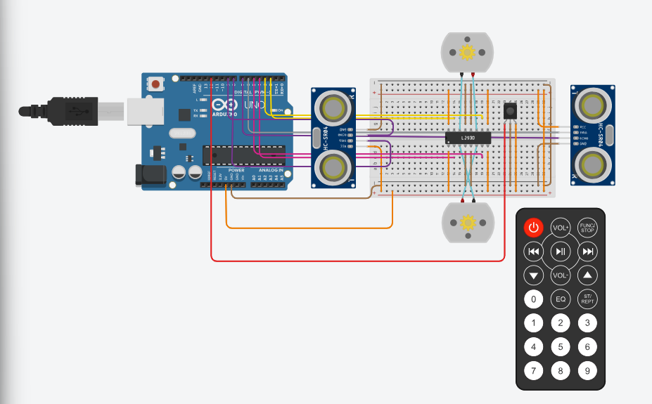
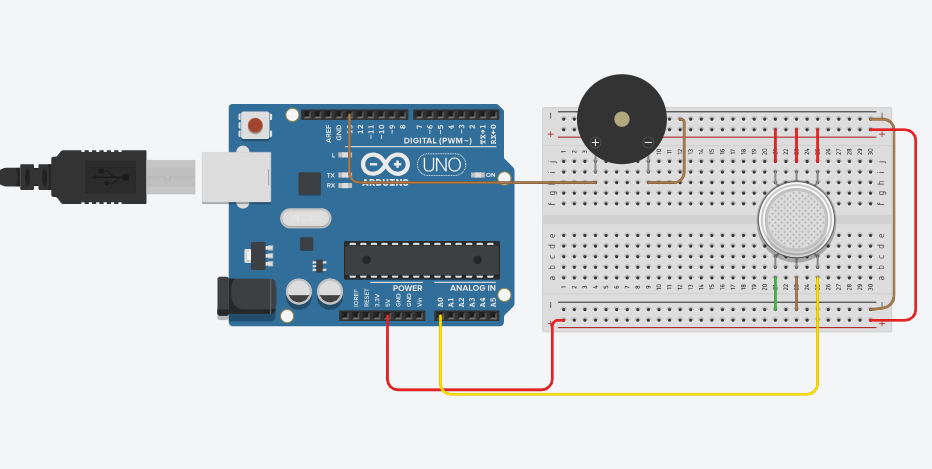
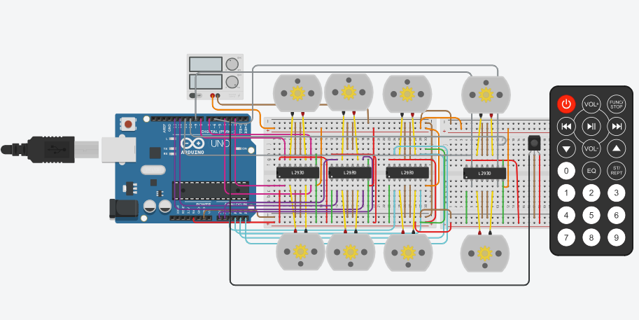
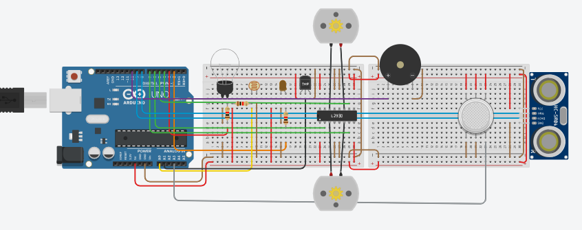
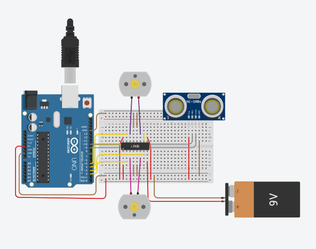

# Arduino Embedded Projects

A collection of Arduino and embedded systems projects developed using sensors, motors, LCD displays, LEDs and automation logic.

This repository contains hands-on embedded systems experiments, hardware-software integration studies and real-time electronics programming practices using Arduino and C++.

---

## 🚀 Included Projects

### 🔌 Sensor-Based Projects
- Distance Sensor Systems
- Vehicle Parking Sensor
- Gas Warning System
- LDR Sensor Applications
- Temperature Monitoring Studies

### 💡 LED & Lighting Projects
- RGB LED Projects
- Timed LED Systems
- Button-Controlled LEDs
- Brightness Control Applications
- Potentiometer-Based LED Control

### ⚙️ Motor & Automation Projects
- DC Motor Control
- Servo Motor Applications
- Obstacle Avoiding Robot
- Bluetooth Compressor System
- Robot Control Experiments

### 🖥️ Display & Interface Projects
- LCD Screen Applications
- Traffic Light Simulation
- Buzzer Notification Systems
- Multi-Button Control Systems

---

## 🛠️ Technologies Used

- Arduino
- Embedded C/C++
- Sensor Integration
- Serial Communication
- Electronics & Circuit Design
- Hardware Automation

---

## 🔌 Hardware Components

- Arduino UNO / Nano
- HC-SR04 Distance Sensor
- Servo Motors
- DC Motors
- LDR Sensors
- Gas Sensors
- LCD Displays
- RGB LEDs
- Buzzers
- Potentiometers
- Bluetooth Modules
- Push Buttons

---

## 📁 Project Structure

```text
arduino-embedded-projects/
├── images/
├── docs/
├── basicConcepts.cpp
├── bluetoothCompressor.cpp
├── burglarAlarm.cpp
├── buttonOperatedTrafficLight.cpp
├── buzzerProjects.cpp
├── dcMotor.cpp
├── distanceSensor.cpp
├── distanceSensor2.cpp
├── gasWarningSystem.cpp
├── increasingTheBrightnessOfTheLed.cpp
├── lcdScreen2.cpp
├── lcdScreen3.cpp
├── ldrSensor.cpp
├── ldrSensor2.cpp
├── ldrSensor3.cpp
├── ldrSensor4.cpp
├── ledControlWitTwoButton.cpp
├── lightingLed.cpp
├── mixedProjects.cpp
├── myRobotProject.cpp
├── obstacleAvoidingRobot.cpp
├── obstacleAvoidingRobot2.cpp
├── potentiometerRgbStudies.cpp
├── potentiometerSpeedControl.cpp
├── rgbLedBurning.cpp
├── servoMotor.cpp
├── servoMotor2.cpp
├── servoMotor3.cpp
├── temperatureStudies.cpp
├── threeButtonControl.cpp
├── turningOnLedWithButton.cpp
├── turningOnTimedLedWithButton.cpp
├── vehicleParkingSensor.cpp
├── workingWithPotentiometers.cpp
├── workingWithRgbLed.cpp
└── README.md
```

---

## 📸 Project Preview

### Obstacle Avoiding Robot



---

### Gas Warning System



---

### Three Direction Robot



---

### Bluetooth Compressor System



---

### Vehicle Parking Sensor



---

## 📄 Project Documentation

Detailed project reports and technical documentation are available in the `docs/` folder.

Included documentation:
- Bluetooth Controlled System Report
- Obstacle Avoiding Robot Report
- Joystick Snake Game Report
- Three-Axis Robot System Report

---

## 🧠 Concepts Practiced

- Embedded systems programming
- Real-time hardware interaction
- Sensor integration
- Automation logic
- Motor control systems
- Hardware-software communication
- Microcontroller programming
- Electronics prototyping

---

## 📚 Purpose

This repository was created to improve embedded systems development, hardware integration and real-time programming skills through practical Arduino-based applications and experiments.

The projects in this repository represent my hands-on learning journey in embedded systems, robotics and hardware-software integration.

---

## 👩‍💻 Developer

Merve Karagülle  
Software Engineering Student | Robotics & Embedded Systems Enthusiast

---

## 🔗 Links

- GitHub Profile: https://github.com/merve-karagulle
- Portfolio Website: https://personal-portfolio-website-rust-iota.vercel.app/
- LinkedIn: https://www.linkedin.com/in/merve-karag%C3%BClle-yazilim/
